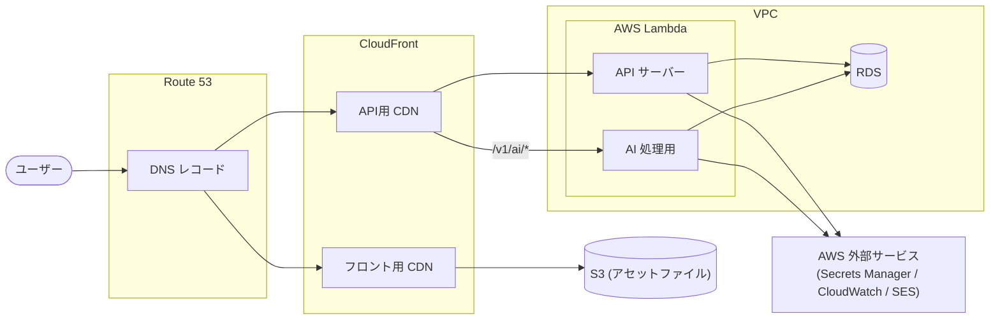

# Supportocol

Supportocolは、議論の迷子を防ぎ、体系的な対話を支援するためのプラットフォームです。

時系列に発言が流れてしまう一般的なチャットツールや会議とは異なり、「どの意見が、何に対するものか」という構造（木構造・コメントフレーム）を視覚化することで、思考の整理と建設的な議論の促進をサポートします。

[公開先はこちら](https://supportocol.hick-r.com/)

## 技術スタック

本プロジェクトは、保守性・再現性・堅牢性を考慮し、以下の技術を採用しています。

| 区分               | 技術要素                    | 選定理由                                                                                                         |
| :----------------- | :-------------------------- | :--------------------------------------------------------------------------------------------------------------- |
| **バックエンド**   | Go                          | 型安全による保守性の高さを考慮し選定。                                                                           |
| **API 仕様**       | OpenAPI                     | OpenAPI仕様書からGoのサーバーコードとTypeScriptのクライアントコードを自動生成し、APIの整合性を確保するため選定。 |
| **フロントエンド** | TypeScript / Lit / Vite     | 標準技術であるWeb Componentsにより、持続可能性と再利用性の高いUIを実現するため選定。                             |
| **インフラ**       | AWS                         | 業務でも利用しているため、学習のために選定。                                                                     |
| **IaC**            | AWS CDK                     | インフラ構成をコード管理し、デプロイの再現性を確保するため選定。                                                 |
| **Dev Tools**      | Docker, Dev Containers, Air | 開発環境のコンテナ化と、Goのホットリロードによる開発効率向上。                                                   |

## ディレクトリ構成

```text
.
├── .devcontainer/     # VS Code用の開発コンテナ環境設定
├── .github/           # GitHub Copilotの設定
├── cdk/               # AWS CDKによるインフラ定義コード
├── cmd/               # アプリケーションのエントリポイント
├── internal/          # ドメインロジックやインフラ層（外部非公開のビジネスロジック）
├── view/              # WebUI
└── Makefile           # 開発・デプロイ用のコマンドタスク
```

### （ドメイン駆動設計の）境界づけられたコンテキスト

`internal/` 配下は、境界づけられたコンテキストとして構成しています。各コンテキストは独立したディレクトリを持ち、固有のドメインモデル・ユースケース・インフラを実装します。

| コンテキスト                    | ディレクトリ          | 責務                                                                                                                     |
| :------------------------------ | :-------------------- | :----------------------------------------------------------------------------------------------------------------------- |
| **対話 (dialogue)**             | `internal/dialogue/`  | 他者との構造化された議論。定義済みコメントフレームによる体系的な対話を提供する。                                         |
| **学習 (learning)**             | `internal/learning/`  | 個人の思考整理。AI利用やWebコンテンツ取得など学習固有の機能を含む。                                                      |
| **アイデンティティ (identity)** | `internal/identity/`  | ユーザーの識別と認証。登録・ログイン・メール認証・パスワードリセット・Googleログインなどを担う。                         |
| **ワークスペース (workspace)**  | `internal/workspace/` | ワークスペースとプロジェクトの管理。メンバー管理・権限判定・お気に入り登録など他コンテキストの基盤となる機能を提供する。 |

各コンテキストは以下の共通構造を持ちます。

```text
<context>/
├── container.go    # 依存関係の組み立て（DI）
├── api/            # HTTPインターフェース（OpenAPI自動生成コードとハンドラ）
├── domain/         # ドメインモデル・ドメインサービス・リポジトリインターフェース
├── usecase/        # アプリケーションサービス（ユースケース）
└── infra/          # インフラ実装（DB・アダプタ・ロギング・AI等）
```

コンテキスト間の連携は、`internal/app/containers.go` で各コンテキストの `Container` を組み立てる際に、必要なサービスをインターフェース経由で注入することで行います。例えば `workspace` コンテキストが提供する権限判定サービスを `dialogue`・`learning` コンテキストのアダプタ経由で利用しています。

## AWS インフラ構成

`cdk/` 配下は AWS CDK (Go) によりインフラをコード定義しています。

### 構成図


